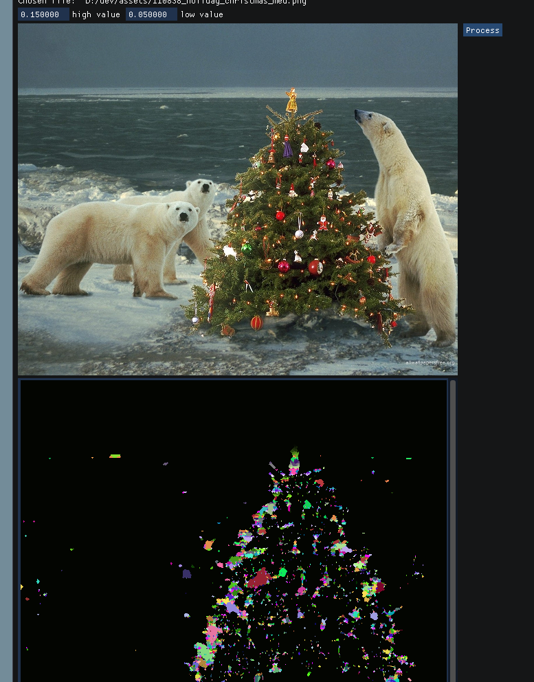

# image_artist
simple program to 'artify' images

Using Dear ImGUI as a GUI framework and ITK (itk.org) for image processing, mess with input images. This is a new project and very much a work in progress.

Please note, user macros for the build are not implemented yet.
